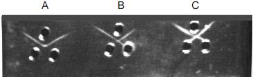

#### Materials Required

1. Agarose
2. 1X Assay buffer
3. Antiserum
4. Test Antigens (Ag1 and Ag2)
5. Glass slide
6. Gel punch with syringe
7. Template
8. Incubator (37˚C)
9. Conical flask
10. Measuring cylinder
11. Alcohol
12. Distilled water
13. Micropipette and pipette tip
14. Petri plate
15. Cotton
 

### Procedure
 

1. Prepare 25 ml of 1.2% agarose (0.3 g /25 ml) in 1X assay buffer by boiling to dissolve the agarose completely.

2. Cool the solution to 55-60°C and pour 4 ml/slide on to  grease free glass slide placed on a horizontal surface. Allow the gel to set for 30 minutes.

3. Punch wells by keeping the glass plate on the template.

4. Fill the lower well with 10µl of antiserum and the upper two wells with 10 µl each of Antigen 1 and 2.

5. Keep the glass plate in a moist chamber overnight at 37°C.

6. After incubation, observe for opaque precipitin lines between the antigen and antisera wells.
 

### Observations and Results
 

Observe for the presence of precipitin lines between the antigen and antisera wells.

1. If pattern A or ‘pattern of identity’ is observed between the antigens and the antiserum, it indicates that the antigens are immunologically identical.

2. If pattern B or ‘pattern of partial identity’ is observed, it indicates that the antigens are partially similar or cross-reactive.

3. If pattern C or ‘pattern of non-identity’ is observed, it indicates that there is no cross-reaction between the antigens,i.e the two antigens are immunologically unrelated.

&nbsp;

Fig 2 : Glass plate showing pattern of lines obtained following Ouchterlony double diffusion

 
#### Precautions

&nbsp;

1. Wipe the glass plate with alcohol to make it grease free for even spreading of agarose.

2. Ensure that the moist chamber has enough wet cotton to keep the chamber humid.

3. If you are provided with 10X assay buffer, dilute the required amount of 10X assay buffer to 1X with distilled water.

4. Reconstitute each vial containing the antigen and antiserum with 0.2 ml of 1X assay buffer. Mix it well and allow it to stand for 30 minutes. Store at 4°C.  Use within 3 months.

5. Assay Buffer: Phosphate buffered saline (PBS).

6.  Wear heat protective gloves when making the agarose solution.
