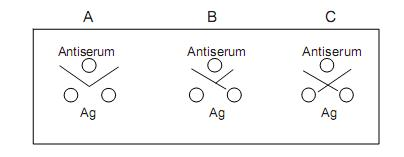

## Principle

&nbsp;

The key reaction of immunology and immune defense is the interaction of antibodies and antigens.  This interaction  is responsible for the body’s defense against viral and bacterial infections and other toxins.  The body’s defense mechanism  recognizes foreign substances, or antigens, and raises specific antibodies against them.   
 
The specificity of antigen-antibody interactions has led to the development of a variety of immunologic assays, which can be used to detect the presence of either antibody or antigen. Immunodiffusion in gels encompasses a variety of techniques, which are useful for the analysis of antigens and antibodies. An antigen reacts with a specific antibody to form an antigen-antibody complex, the composition of which depends on the nature, concentration and proportion of the initial reactants.

Immunodiffusion in gels are classified as single diffusion and double diffusion. In Ouchterlony double diffusion, both antigen and antibody are allowed to diffuse into the gel. This technique can be used to test the similarity between antigens, for example in a study of evolution.  Antigens from different species are loaded into two wells and the known antibody is loaded in a third well located between and slightly below the antigen wells to form a triangle. Depending on the similarity between the antigens, different geometrical patterns are produced between the antigen and antiserum wells. The pattern of lines that form can be interpreted to determine whether the antigens are same or different.

&nbsp;

Fig 1: Different patterns of lines obtained on Ouchterlony  double diffusion

 
&nbsp;

### Pattern of Identity: A
 

The antibodies in the antiserum react with both the antigens resulting in a smooth line of precipitate. The antibodies cannot distinguish between the two antigens. i.e., the two antigens are immunologically identical.

 

### Pattern of Partial Identity: B
 

In the ‘pattern of partial identity’, the antibodies in the antiserum react more with one of the antigens than the other. The ‘spur’ is thought to result from the determinants present in one antigen but lacking in the other antigen

 

### Pattern of Non-Identity: C
 

In the ‘pattern of non-identity’, none of the antibodies in the antiserum react with antigenic determinants that may be present in both the antigens, i.e., the two antigens are immunologically unrelated as far as that antiserum is concerned.
